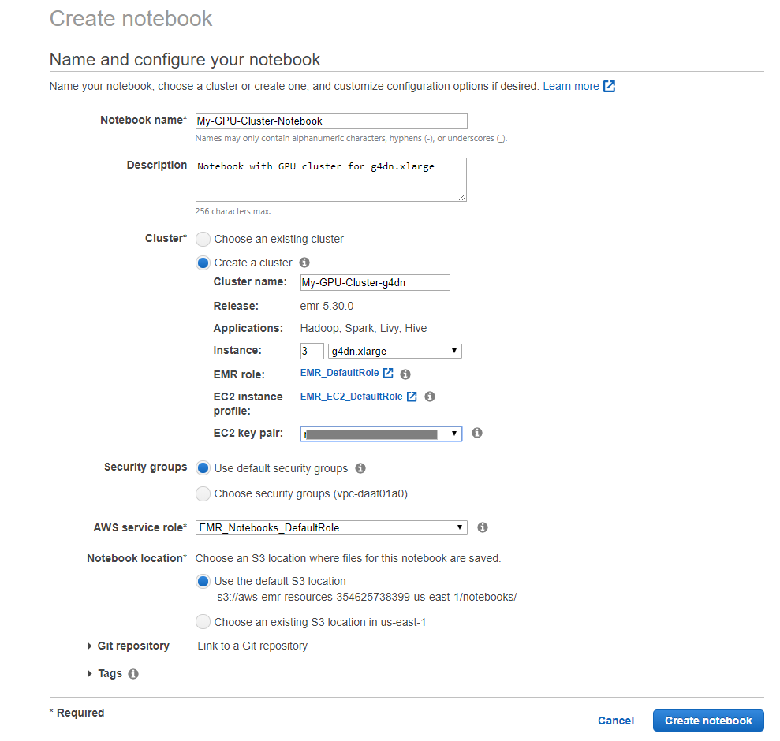
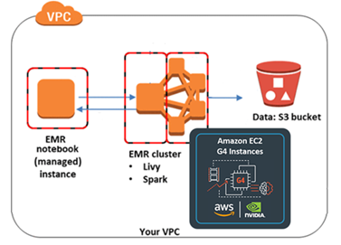
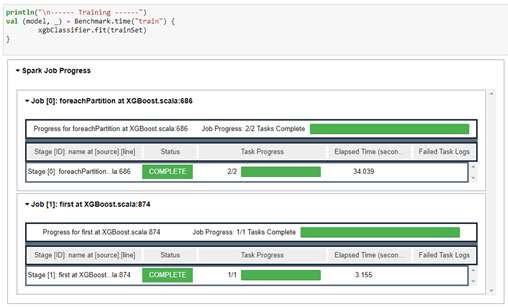

# Get Started with GPU Accelerated Spark Using AWS EMR Notebook

You can use the following step-by-step guide to run the example mortgage dataset using open source XGBoost library on Amazon EMR GPU clusters.  For more examples, please refer to https://github.com/rapidsai/spark-examples

An EMR Notebook is a "serverless" Jupyter notebook. Unlike a traditional notebook, the contents of an EMR Notebook itself—the equations, visualizations, queries, models, code, and narrative text—are saved in Amazon S3 separately from the cluster that runs the code. This provides an EMR Notebook with durable storage, efficient access, and flexibility.

For more information, please go to https://docs.aws.amazon.com/emr/latest/ManagementGuide/emr-managed-notebooks.html

### Step 1:  Create EMR Notebook and Cluster using Amazon EMR GUI

Go to the AWS Management Console and select the Amazon EMR service from the "Analytics" section. Choose the region you want to launch your cluster in, typically in the same region as your Amazon S3 bucket where you store large training datasets. Select Notebooks on the left column and click the Create notebook button. In the detailed configuration page, you can create a new cluster with notebook instances by setting the GPU node. In this example, we add three Amazon EC2 g4dn.xlarge GPU nodes to the new cluster. 




### Step 2: (Alternative to Step 1) Create GPU Clustger separately Using AWS CLI

If you want to customize your cluster with advanced configuration, you can also create a GPU cluster separately, then create an Amazon EMR Notebook and connect to the existing GPU cluster. You can use the following AWS CLI to launch a GPU cluster with 2x Amazon EC2 G4dn instances as core nodes in one command line.  

For g4dn.xlarge
```
aws emr create-cluster --termination-protected --applications Name=Hadoop Name=Spark Name=Livy --tags 'name=nvidia-gpu-spark' --ec2-attributes '{"KeyName":"your-key-name","InstanceProfile":"EMR_EC2_DefaultRole","SubnetId":"your-subnet-ID","EmrManagedSlaveSecurityGroup":"your-EMR-slave-security-group-ID","EmrManagedMasterSecurityGroup":"your-EMR-master-security-group-ID"}' --release-label emr-5.30.0 --log-uri 's3n://your-s3-bucket/elasticmapreduce/' --instance-groups '[{"InstanceCount":2,"InstanceGroupType":"CORE","InstanceType":"g4dn.xlarge","Name":"Core - 2"},{"InstanceCount":1,"EbsConfiguration":{"EbsBlockDeviceConfigs":[{"VolumeSpecification":{"SizeInGB":32,"VolumeType":"gp2"},"VolumesPerInstance":2}]},"InstanceGroupType":"MASTER","InstanceType":"m5.xlarge","Name":"Master - 1"}]' --configurations '[{"Classification":"spark-defaults","Properties":{"spark.dynamicAllocation.enabled":"false"}}]' --auto-scaling-role EMR_AutoScaling_DefaultRole --ebs-root-volume-size 10 --service-role EMR_DefaultRole --enable-debugging --name 'nvidia-gpu-spark' --scale-down-behavior TERMINATE_AT_TASK_COMPLETION --region us-east-1
```

Please fill the actual values for KeyName, SubnetId, EmrManagedSlaveSecurityGroup, EmrManagedMasterSecurityGroup,  and Amazon S3 bucket for logs, name and region.  

You can also use AWS consoles to [configure the Amazon EMR cluster step by step.](emr.md).


### Step 3:  Run Open Source XGBoost Library and Mortgage Examples on Amazon EMR Notebook

Once the cluster is ready, go to the Amazon EMR Notebooks, click on the Amazon Notebook instance, and click Open in Jupyter. Start the Amazon Notebook instance if it is not running.

Please download this example notebook [EMR_Mortgage_Example_G4dn.ipynb](EMR_Mortgage_Example_G4dn.ipynb) from Github and upload to the Amazon EMR Notebook instance.  More Scala example code can be found [here](https://github.com/rapidsai/spark-examples/tree/master/examples/notebooks/scala).

Now enter the mortgage example notebook to run the GPU accelerated Apache Spark code on Open Source XGBoost library towards a small mortgage dataset on Amazon S3.  If the notebook kernel is not set to Apache Spark, please go to Kernel -> Change Kernel to set Apache Spark as the kernel. The Amazon EMR notebook is talking to the Amazon EMR cluster running Apache Spark using Apache Livy as shown in the below diagram.



###  Step 4: Customize Your Spark Job Configurations

You can always customize your Apache Spark job configurations such as number of executors, number of cores, and executor memory base on your GPU cluster.  Each GPU maps to one executor. 

###  Step 5: View the training and transform results and benchmark

In the Amazon EMR Notebook, you can view the Apache Spark job progress visually and the benchmark results. The trained model can be saved to a local folder or Amazon S3 bucket. 





```
------ Training ------
==> Benchmark: Elapsed time for [train]: 37.881s
model: ml.dmlc.xgboost4j.scala.spark.XGBoostClassificationModel = xgbc_d5a83fea59b5
 
------ Transforming ------
==> Benchmark: Elapsed time for [transform]: 0.115s
…
------Accuracy of Evaluation------
evaluator: org.apache.spark.ml.evaluation.MulticlassClassificationEvaluator = mcEval_daa2cccd95a4
accuracy: Double = 0.9875007589803053
0.9875007589803053
…
```

###  Step 6: Clean Up All AWS Resource 

To avoid ongoing charges for resources you created for this benchmarking, delete all the resources you created for this benchmarking. This includes the data on Amazon S3 bucket, Amazon EMR Cluster, and the Amazon EMR Notebook. 

